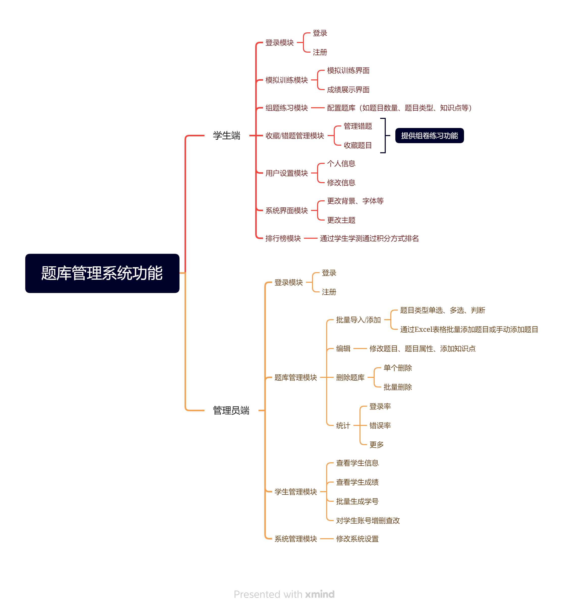

### 零、项目成员与暂定分工

1. 陈进龙（后端）
2. 范阿叹（后端）
3. 李梦琪（组长，文档组织与前端）

### 一、题目

校内信息素养学测平台

### 二、选题背景（李梦琪）

#### 1. 信息素养的重要性

> 信息素养是当代大学生所必备的基本素养之一，面对海量的信息资源，如何高效地进行资源检索、搜集信息、辨别信息的真伪等都是信息素养能力的体现。

提高个人信息素养对于某些特定专业的学习具有重要意义。如学习计算机科学与技术，通过快速、准确的检索筛选，可以大幅提高学习效率，能快速定位并解决编程中所遇到的问题。即使不针对特定专业的学习，良好的信息检索习惯、筛选能力，也会对个人的工作与生活起到积极帮助。尤其是在数字化、信息化的当代，当我们拥有了 ChatGPT 这样惊人的 AI 工具，学会提问其实也是信息素养的一种体现。

#### 2. 便于备赛“全国高职高专院校信息素养大赛”

目前全国高职高专院校信息素养大赛已经成功举办了四届，根据《国家职业教育改革实施方案》、《教育信息化2.0行动计划》、《普通高等学校图书馆规程》等有关文件精神，以及《高等学校数字校园建设规范（试行）》关于开展信息素养教育的总体要求、当今信息化的快速发展，可以预见，在未来的 5-10年中，信息素养比赛的热度难减，并且极有可能越来越受到学生的关注与社会认可。

于是如何高效备赛，在促进能力提升的同时，如何增大获奖几率就成了一个问题。

目前主办方虽然在比赛平台上提供了模拟赛训练的功能，但是由于缺乏题目解析 、知识点分类、错题统计与分析、练习统计与分析等功能，参赛选手只能靠重刷某套题目来练习。遇到错题，只能将其截图下来在QQ群等社群中向老师提问，以等待答疑。这无疑是一种较为低效的备赛方式，同时也给指导老师的持续指导带来了不少的麻烦，不容易搞清参赛选手的弱项以及总体水平。

如何让每年参赛选手的经验留存下来，指导老师在指导过程中所形成的题目解析与知识点概括留存下来，方便后来者快速地提纲挈领，就引出了来做一个校内的信息素养学测平台的想法。

除了导入官方的题库之外，指导教师可以自由出题，可以添加题目解析，可以通过将每道题目加上知识点标签的方法，使学生能快速进行专题练习成为可能，进而能够有着重点地攻克学习薄弱的地方。同时通过本校学生的做题数据，指导老师可以进行有针对性的辅导，以及对学习方向、重难点有更好的把控。

通过这样一个平台，不仅为备赛提供了更好的环境，也为以后在校内开设信息素养相关的选修课提供了基础。选修学生可以通过该平台推开信息素养的大门，可以看到往届学长、学姐的做题排名，学校在历届比赛中所斩获的荣誉，这种认同感与学习氛围可以很自然地起到宣传作用，促进高校学生信息素养能力的培养。

纵观全国的各大高校，独立的学测平台一般都是算法评测系统，而这个项目的实践虽不算创新，但也是少有之尝试，可以拓宽大学生们进行项目实践的思维广度。

#### 3. 多方利益考量

**校图书馆**：多了一个可用的内部学习管理平台，增强了图书馆的信息化建设以及影响力。

**指导老师**：可以减轻指导老师在校赛时期由于参赛同学众多的指导压力，并提高指导效率、方便总结指导经验。并为以后《信息素养》选修课的开设提供平台保障，有利于学生信息素养的总体提高以及校赛的选拔。

**项目成员**：通过筹划、实践这样一个项目，一方面可以锻炼项目成员的编程、协作、自主解决问题的能力；另一方面可以当作《软件工程》课程以及毕业设计的项目实践，减轻项目成员总体的学业负担；最后，该项目可以参加2024年度的“中国大学生计算机设计大赛”，增加团队成员的项目经验，对于工作面试有一定帮助。

### 三、初步需求分析（范阿叹）

#### 1. 用户特点分析

1. 大部分是学生，具有学习经验文章、刷题以及错题管理的需求。根据学生特质，适当加入一些游戏化学习的理念来设计平台，能提高学生的学习兴趣。如提供做题排名等。
2. 小部分是教师，具有管理学生账号、题库，分析做题数据，发布文章，以及管理平台的总体设置的需求。

#### 2. 数据需求分析

1. 单/多选题题目：
   1. 题目唯一编号
   2. 题型：单/多选
   3. 知识点（可能有多个）
   4. 错误率
   5. 被做次数
   6. 难度：低/中/高（当被做次数达到一定数量时，根据错误率来自动判断）
   7. 题目来源
   8. 出题年份
   9. 题干内容
   10. 选项 1
   11. 选项 2
   12. 选项 3
   13. 选项 4
   14. 正确答案
   15. 题目解析

2. 判断题题目：大致等同于 1

3. 用户信息
   1. 用户唯一编号
   2. 昵称
   3. 电话号码
   4. 密码
   5. 头像
   6. 个性签名
   7. 班级信息

#### 3. 软件规模分析

1. 预估同时使用的用户数不超过 200 人。
2. 题库中题目的数量初步预估在 5000 条之内。

### 四、初步功能分析（陈进龙）

该学测平台由两部分构成：用户端（学生）、管理员端（教师）。

#### 0. 概览

#### 1. 用户端

1. **登录模块**；学生可以通过账号、密码登录系统。（是否可以自由注册需要再考量，一般是管理员通过学号批量生成学生账号，以供学生登录）
   * 登录页面

2. **模拟训练模块**：学生可以通过管理员预先发布的模拟训练试卷进行测试。
   * 模拟训练页面
   * 成绩展示页面

3. **组题练习模块**：学生可以通过配置，如预设题目数量、题目类型、知识点类型等生成试题集进行练习。
   * 组题页面

4. **收藏/错题管理模块**：学生可以可以管理错题，应当也可以收藏题目，对于这些题目，提供一键组卷练习的功能。
   * 收藏、错题管理页面

5. **用户设置模块**：学生可以查看和修改个人信息。
   * 个人信息页面
6. **系统界面模块**：提供一些个性化选项，如修改背景、主题、字体大小等。
   * 系统设置页面
7. **排行榜模块**：基于游戏化的设计理念，可以通过积分将学生的学测活动定量化，通过积分排名的形式，提高大家的学习积极性。
   * 排行榜页面

#### 2. 管理员端
1. **登录模块**：等同于用户端的登录模块。

2. **题库管理模块**
   1. **批量导入/添加**：题目类型分为选择（单选、多选）、判断，管理员可以通过固定格式的 Excel 表格批量添加题目，也可以手动在后台添加单个题目。
   2. **编辑**：可以修改题目属性，给题目添加知识点标签、题目来源等细分属性。
   3. **删除**：可以删除单个题目或批量删除题目。
   4. **统计**：可以查看题目的相关统计信息，如错误率。

3. **学生管理模块**：管理员可以通过学号批量生产学生账号，主要是对学生账号的增删改查。

4. **系统管理模块**：管理员可以修改系统设置。如有公告板模块的话，可以在设置中修改公告内容。

### 五、初步的技术路线

1. 前端：Vue（版本未定）
2. 后端：Spring 框架（ Java 语言）
3. 数据库：mysql（版本未定）
