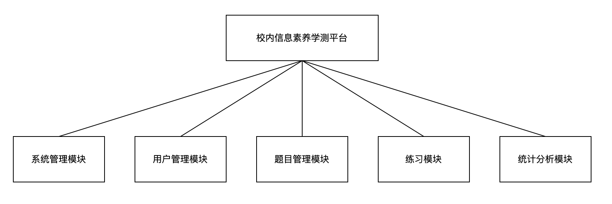

# 概要设计阶段

## 1. 层次图（H图）

系统总体结构：

### 1.1 各个模块的具体功能

* 校内信息素养学测平台
  1. **系统管理模块**
     系统的基本配置和管理。包括设置系统参数、备份和恢复数据、日志管理等操作。
  2. **用户管理模块**
     管理学生和教师用户的注册、登陆、修改个人信息和重置密码等操作。
  3. **题目管理模块**
     添加、修改和删除选择题和判断题等题目信息，以及查询和导出题目信息等操作。
  4. **练习模块**
     负责展示题目和答案选项，接受学生提交答案，自动评分并显示成绩等操作。
  5. **统计分析模块**
     负责统计和分析学生做题情况和成绩，以及展示学生和题目相关的统计数据和图表等操作。

## 2. 数据库设计

### 1. 实体分析

1. 用户
2. 题目/试题
3. 试卷/试题集
4. 考试记录
5. 错题

### 2. E-R 图

### 3. 数据库二维表设计

**注：另考虑到系统日志表，先做功能描述，暂不设计其二维表。**
系统日志表功能：这张表用来记录平台的操作日志，包括管理员的登录、添加题目、修改题目、删除题目等操作。日志表可以包含管理员ID、操作时间、操作类型、操作内容等字段。

#### 1. User Table (用户表)

| 字段名     | 数据类型                                 | 说明/描述                |
| ---------- | ---------------------------------------- | ------------------------ |
| id         | int                                      | 用户ID，主键             |
| username   | varchar(20)                              | 用户名                   |
| password   | varchar(50)                              | 密码(MD5加密后的值)      |
| role       | enum('teacher', 'student')               | 用户类型，如学生、老师等 |
| privilege  | enum('普通用户', '管理员', '超级管理员') | 用户角色/权限            |
| student_id | varchar(10)                              | 学号（仅学生类型有）     |
| teacher_id | varchar(10)                              | 教工号（仅教师类型有）   |
| realname   | varchar(20)                              | 姓名                     |
| email      | varchar(50)                              | 邮箱                     |
| created_at | datetime                                 | 用户创建时间             |

#### 2. Question Table (题目/试题表)

| 字段名     | 数据类型                     | 主键/外键 | 空值 | 说明/描述                                                 |
| ---------- | ---------------------------- | --------- | ---- | --------------------------------------------------------- |
| id         | int                          | 主键      | 否   | 题目ID                                                    |
| type       | enum('单选', '多选', '判断') |           | 否   | 题目类型，如选择题、判断题                                |
| question   | varchar(255)                 |           | 否   | 题干的具体内容                                            |
| answer     | varchar(50)                  |           | 否   | 试题的正确答案，例如A、B、C或D（选择题）或对/错（判断题） |
| optionA    | varchar(255)                 |           | 否   | 选项A                                                     |
| optionB    | varchar(255)                 |           | 否   | 选项B                                                     |
| optionC    | varchar(255)                 |           | 否   | 选项C                                                     |
| optionD    | varchar(255)                 |           | 否   | 选项D                                                     |
| difficulty | emus('1', '3', '5')          |           | 是   | 试题的难度等级（简单，中等，困难）                        |
| created_at | datetime                     |           | 否   | 试题创建的时间                                            |
| updated_at | datetime                     |           | 否   | 试题最近修改的时间                                        |
| source     | varchar(50)                  |           | 是   | 试题来源                                                  |
| tags       | varchar(255)                 |           | 是   | 题目标签                                                  |
| solution   | text                         |           | 是   | 题解                                                      |
| creator_id | int                          | 外键      | 否   | 题目创建者ID                                              |

#### 3. Exam Table (试卷表)

| 字段名                    | 数据类型    | 描述说明                               |
| ------------------------- | ----------- | -------------------------------------- |
| id                        | int         | 试卷ID (Primary Key)                   |
| name                      | varchar(50) | 试卷名称                               |
| teacher_id                | int         | 教师ID (Foreign Key，关联User表中的id) |
| single_choice_questions   | text        | 由40道单选题的题目ID组成，以逗号分隔   |
| multiple_choice_questions | text        | 由20道多选题的题目ID组成，以逗号分隔   |
| judgement_questions       | text        | 由20道判断题的题目ID组成，以逗号分隔   |

#### 4. ExamRecord Table (考试记录表)

| 字段名     | 类型          | 说明                                   |
| ---------- | ------------- | -------------------------------------- |
| id         | int           | 考试记录ID，主键                       |
| exam_id    | int           | 试卷ID (Foreign Key，关联Exam表中的id) |
| student_id | int           | 学生ID (Foreign Key，关联User表中的id) |
| start_time | datetime      | 考试开始时间                           |
| end_time   | datetime      | 考试结束时间                           |
| score      | decimal(5, 2) | 考试得分，保留2位小数                  |

#### 5. WrongAnswer Table (错题表)

| 字段名         | 数据类型 | 描述                            |
| -------------- | -------- | ------------------------------- |
| id             | int      | 错题ID (Primary Key)            |
| user_id        | int      | 学生ID (Foreign Key)            |
| exam_id        | int      | 试卷ID (Foreign Key)            |
| question_id    | int      | 题目ID (Foreign Key)            |
| user_answer    | text     | 学生的答案                      |
| correct_answer | text     | 正确的答案                      |
| is_correct     | tintint  | 是否正确 (1表示正确，0表示错误) |
| created_at     | datetime | 错题创建时间                    |

## 3. 分层设计

1. **用户界面层**
   该层是与用户直接交互的部分，包括学生和老师两种用户类型。学生用户可以在该层上登录、浏览题目、做题和查看成绩等操作；老师用户可以在该层上登录、管理学生用户、添加题目和查看统计数据等操作。
2. **业务逻辑层**
   该层是软件系统的核心部分，负责处理用户请求、执行相应的业务逻辑和生成结果。该层包括选择题和判断题两种类型的题库，学生提交答案后会在该层上进行自动评分，老师在该层上可以进行学生管理和题目管理等操作。

3. **数据持久化层**
   该层是数据的存储和管理层，负责将系统中的数据保存到数据库中，以及从数据库中读取数据并传递给业务逻辑层。该层使用数据库技术来存储用户信息、题目信息、答案信息和成绩信息等数据。
