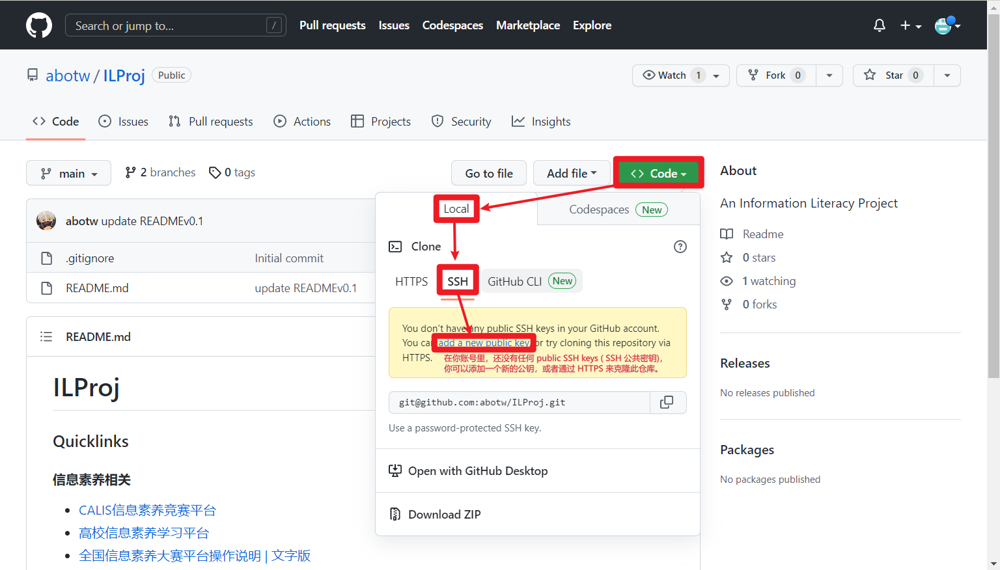
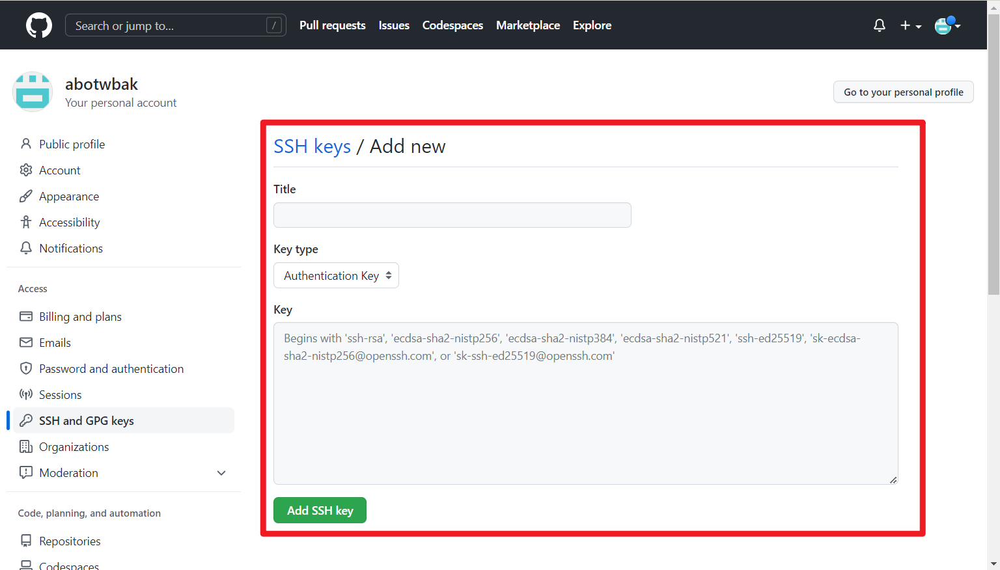
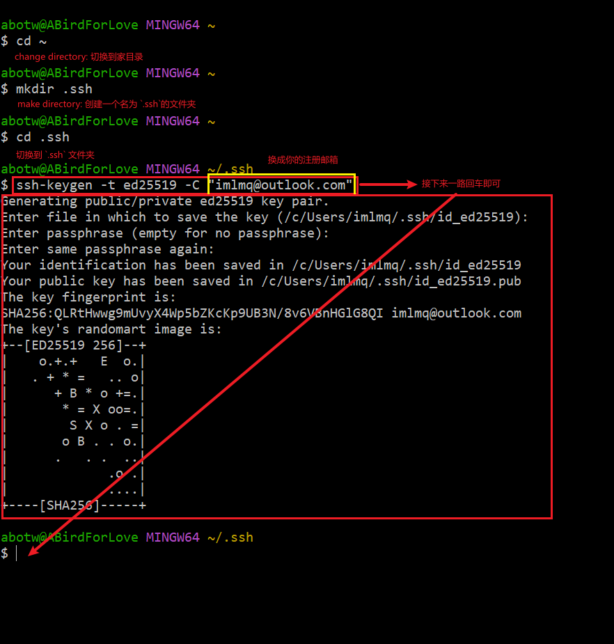
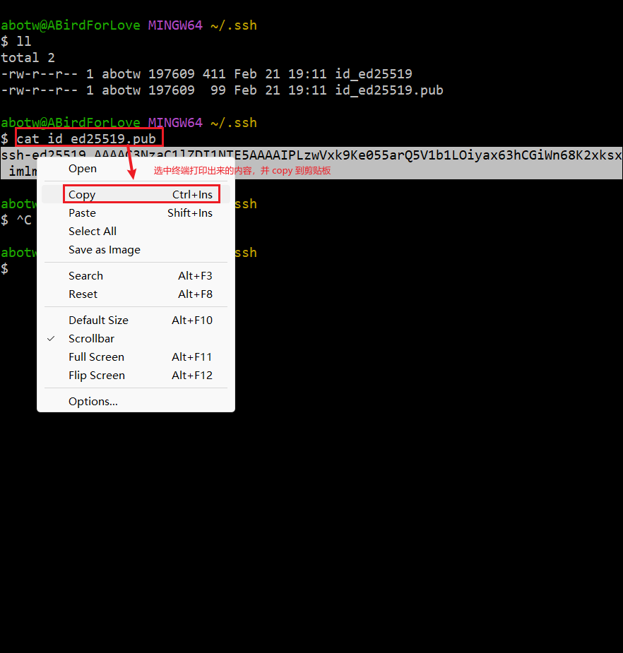
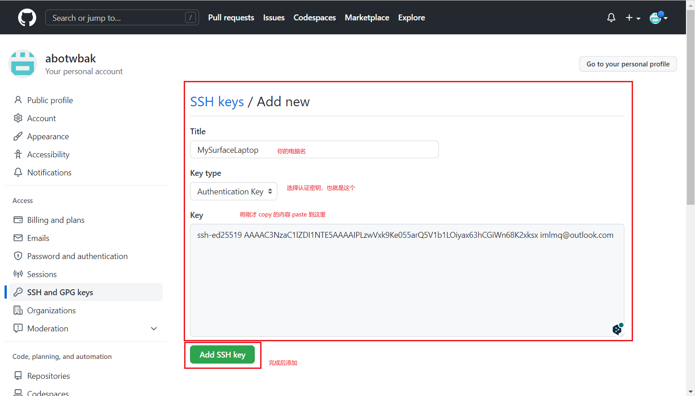
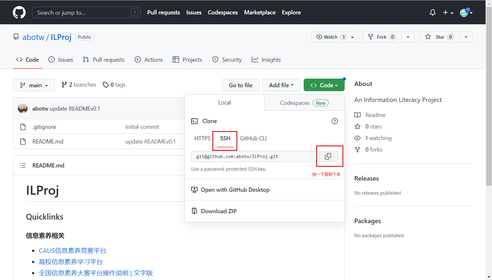
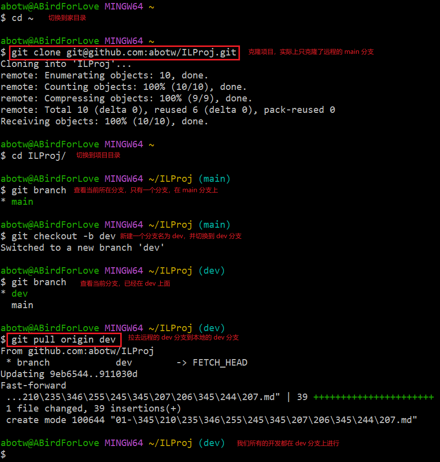

# Git 协作指南 v0.1

Abotw, 230221

### 零、基本概念

#### 1. 分区

首先来理解一下工作区 (working area)、暂存区 (staged area)，本地仓库 (local repo)、远程仓库 (remote repo)的概念。

本地仓库粗略理解有两个分区，工作区和暂存区。

本地工作区 => 修改了文件 => `git add .` => 将所有修改过的文件存放到暂存区 => `git commit -m 'message'` => 将暂存区的文件持久化，保存为一个节点（每一个节点在将来都可以用来回滚，有点游戏存个档的意思，这条命令的 option `-m` 指的是添加一条提交信息，这是必须的，需要用单引号或者双引号包裹) => `git push` => 将当前的所有修改推送到到远程仓库(云端)。

简单来说，一次提交的流程如下：

```bash
git pull # 拉取远程仓库，同步其他伙伴的工作进度
# 开始写自己的代码ing...
git add . # 写个差不多之后，将当前所有修改存放到暂存区
git commit -m 'your commit message' # 存档, 将暂存区的修改持久化为一个节点，以便以后万一读档回滚
git push # 将本地同步到云端
```

#### 2. 分支

目前这个项目暂定为两个分支，一个默认分支 main，一个开发分支 dev。**日常的开发全部在 dev 分支提交**。

可以使用`git branch`查看当前所在分支。
使用`git checkout <branch_name>`切换到某个分支。

### 一、初次使用的操作流程





打开 Git Bash，根据图片输入如下命令：












第一次 `git clone` 的时候，会有一个认证确认，需要输入 `yes`，直接回车不可以。下面这张图片没有显示这个部分是因为我之前已经 `git clone` 过了，需要注意一下。


