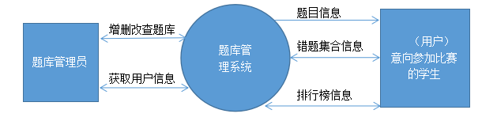
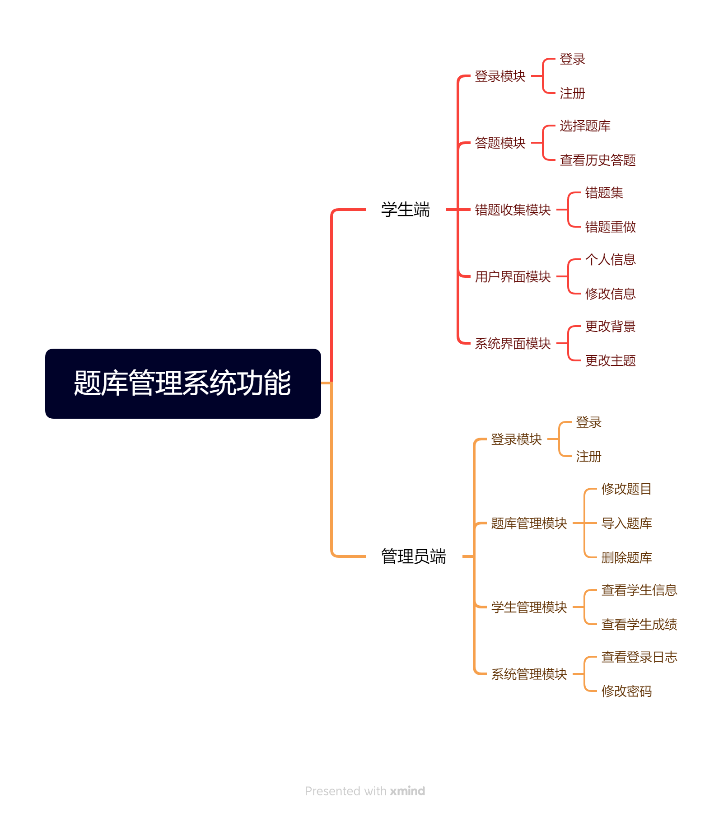

### 零、项目成员与暂定分工

1. 陈进龙（后端）
2. 范阿叹（后端）
3. 李梦琪（组长，文档组织与前端）

### 一、题目

校内信息素养学测平台

### 二、选题背景（李梦琪）

#### 1. 信息素养的重要性

> 信息素养是当代大学生所必备的基本素养之一，面对海量的信息资源，如何高效地进行资源检索、搜集信息、辨别信息的真伪等都是信息素养能力的体现。

提高个人信息素养对于某些特定专业的学习具有重要意义。如学习计算机科学与技术，通过快速、准确的检索筛选，可以大幅提高学习效率，能快速定位并解决编程中所遇到的问题。即使不针对特定专业的学习，良好的信息检索习惯、筛选能力，也会对个人的工作与生活起到积极帮助。尤其是在数字化、信息化的当代，当我们拥有了 ChatGPT 这样惊人的 AI 工具，学会提问其实也是信息素养的一种体现。

#### 2. 便于备赛“全国高职高专院校信息素养大赛”

目前全国高职高专院校信息素养大赛已经成功举办了四届，根据《国家职业教育改革实施方案》、《教育信息化2.0行动计划》、《普通高等学校图书馆规程》等有关文件精神，以及《高等学校数字校园建设规范（试行）》关于开展信息素养教育的总体要求、当今信息化的快速发展，可以预见，在未来的 5-10年中，信息素养比赛的热度难减，并且极有可能越来越受到学生的关注与社会认可。

于是如何高效备赛，在促进能力提升的同时，如何增大获奖几率就成了一个问题。

目前主办方虽然在比赛平台上提供了模拟赛训练的功能，但是由于缺乏题目解析 、知识点分类、错题统计与分析、练习统计与分析等功能，参赛选手只能靠重刷某套题目来练习。遇到错题，只能将其截图下来在QQ群等社群中向老师提问，以等待答疑。这无疑是一种较为低效的备赛方式，同时也给指导老师的持续指导带来了不少的麻烦，不容易搞清参赛选手的弱项以及总体水平。

如何让每年参赛选手的经验留存下来，指导老师在指导过程中所形成的题目解析与知识点概括留存下来，方便后来者快速地提纲挈领，就引出了来做一个校内的信息素养学测平台的想法。

除了导入官方的题库之外，指导教师可以自由出题，可以添加题目解析，可以通过将每道题目加上知识点标签的方法，使学生能快速进行专题练习成为可能，进而能够有着重点地攻克学习薄弱的地方。同时通过本校学生的做题数据，指导老师可以进行有针对性的辅导，以及对学习方向、重难点有更好的把控。

通过这样一个平台，不仅为备赛提供了更好的环境，也为以后在校内开设信息素养相关的选修课提供了基础。选修学生可以通过该平台推开信息素养的大门，可以看到往届学长、学姐的做题排名，学校在历届比赛中所斩获的荣誉，这种认同感与学习氛围可以很自然地起到宣传作用，促进高校学生信息素养能力的培养。

纵观全国的各大高校，独立的学测平台一般都是算法评测系统，而这个项目的实践虽不算创新，但也是少有之尝试，可以拓宽大学生们进行项目实践的思维广度。

#### 3. 多方利益考量

**校图书馆**：多了一个可用的内部学习管理平台，增强了图书馆的信息化建设以及影响力。

**指导老师**：可以减轻指导老师在校赛时期由于参赛同学众多的指导压力，并提高指导效率、方便总结指导经验。并为以后《信息素养》选修课的开设提供平台保障，有利于学生信息素养的总体提高以及校赛的选拔。

**项目成员**：通过筹划、实践这样一个项目，一方面可以锻炼项目成员的编程、协作、自主解决问题的能力；另一方面可以当作《软件工程》课程以及毕业设计的项目实践，减轻项目成员总体的学业负担；最后，该项目可以参加2024年度的“中国大学生计算机设计大赛”，增加团队成员的项目经验，对于工作面试有一定帮助。

### 三、初步需求与功能

#### 1.1. "题库管理系统"软件需求分析（范阿叹）
1.引言

本文档将对题库管理系统的设计需求进行描述，旨在明确系统的目标和功能，为业务人员和设计开发人员提供对统一理解，为题库管理系统的设计、实现、和验收提供依据。本文档的读者是该软件的设计人员、代码编写人员、测试人员、维护人员和该项目的审核验收人员。

1.2编写目的

①　待开发的软件系统名称：题库管理系统。

②　本项目的任务提出者：

③　项目开发者：

1.2参考资料

2.任务概述

(1)项目目标

建立一个题库管理系统，方便参加此类比赛的人的刷题效率，为他们提供方便的操作界面和丰富的功能。

①　方便的界面管理，加入题库和删除题库内容方便

②　为使用者提供，题型分类、错题查询、错题归纳、成绩日排名服务。

③　非登录用户也可进行刷题。

(2)用户的特点

本软件的用户为管理题库的用户和进行刷题的学生，数量相对不多。

3.需求规定

3.1数据描述

(1)数据流图

经过分析数据流图为

(2)数据词典

1)数据流

①　单/多选题题目信息=题目类型+题目编号+题目+选项1+选项2+选项3+答案

②　判断题题目信息=题目类型+题目编号+题目+答案

③　用户信息=用户编号+用户昵称+电话号码+密码+照片+个性签名

2)数据存储数（文件）

①　文件名：选择题目表

组成：{单/多选题题目信息=题目类型+题目编号+题目+选项1+选项2+选项3+答案}

②　文件名：判断题目标

组成：{判断题题目信息=题目类型+题目编号+题目+答案}

③　文件名：用户信息表

组成：{用户信息=用户编号+用户昵称+电话号码+密码+照片+个性签名}

3.2功能需求

本系统有题库管理、用户管理、题库查询、错题收集、系统管理五个功能。

3.3性能需求

题目切换显示答案时长不超过0.5s，题目查询时间不超过3秒。

#### 2. 功能（陈进龙）
系统有两端构成：学生端、管理员端。
学生端
    1.登录模块；学生可以通过账号密码登录系统。
    2.答题模块：学生可以浏览题目并答题。
    3.题库管理：学生可以选择题库并下载。
    4.错题收集模块：学生可以查看自己的错题信息。
    5.用户界面模块：学生可以查看和修改个人信息。
    6.系统管理模块：学生可以修改系统设置。
管理员端
    1.登录模块：管理员可以使用账号密码登录。
    2.题库管理模块：管理员可以添加和删除题库。
    3.学生管理模块：管理员可以查看或删除学生信息。
    4.系统管理模块：管理员可以修改系统设置。

思维导图

### 四、初步的技术路线

1. 前端：Vue（版本未定）
2. 后端：Spring 框架（ Java 语言）
3. 数据库：mysql（版本未定）
